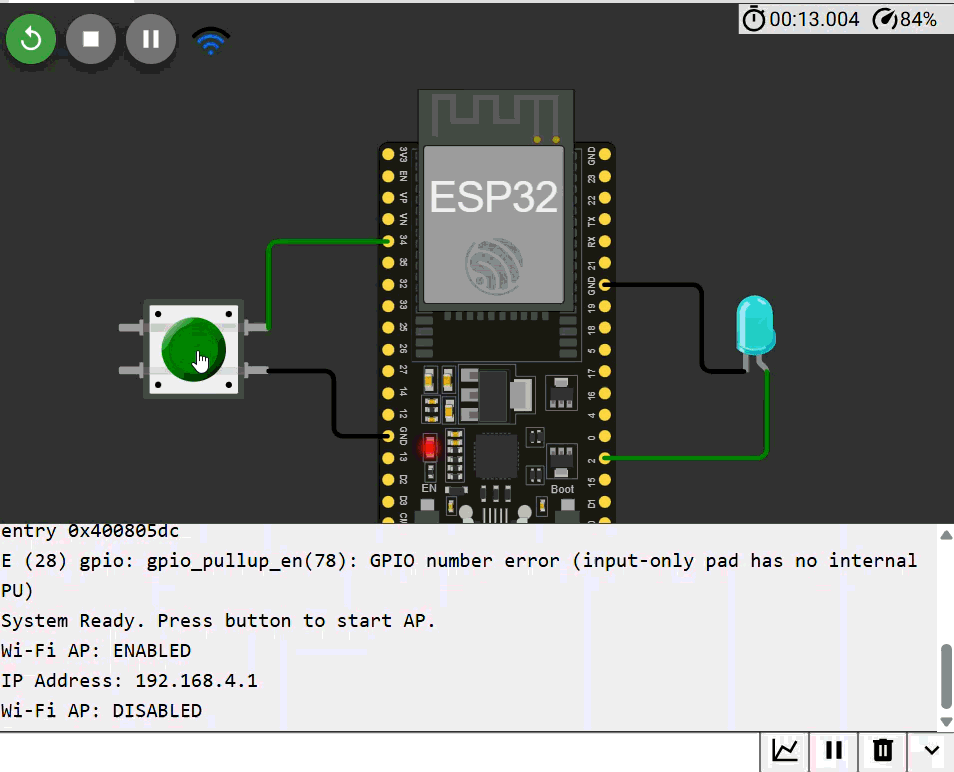

# WiFI_AP_Switch
This project demonstrates basic skills in working with the ESP32 and controlling the state of the radio module using a physical button.

The program turns the ESP32 into a Soft Access Point (Access Point) at the user's request.

- Button (GPIO 34): Works as a trigger (Toggle) to turn on/off Wi-Fi.

- LED indicator (GPIO 2): Visualizes the activity status of the Wi-Fi module.

- Serial Monitor: Displays the current IP address and system status.

  You can launch the project at the link https://wokwi.com/projects/458695221173325825

  
